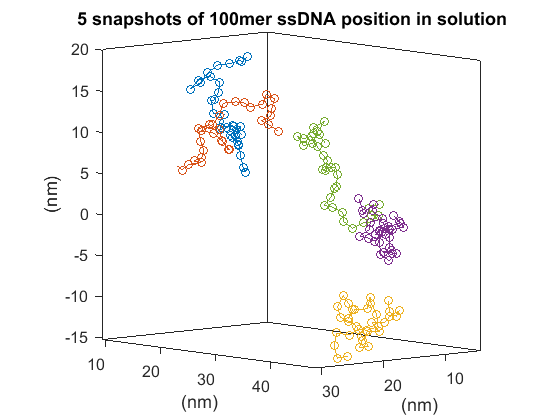
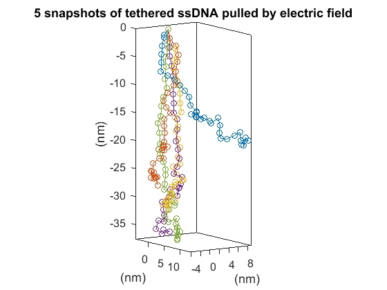
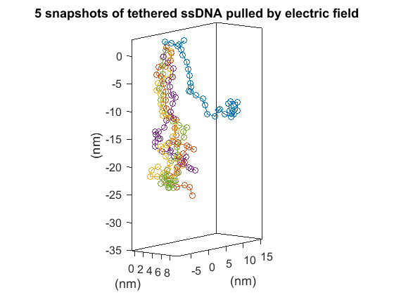
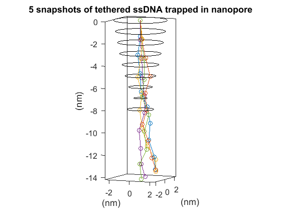
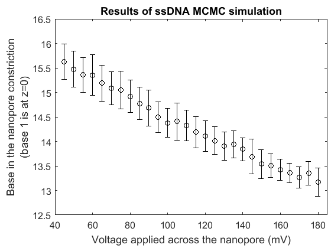

ssDNA_MCMC
=======

## What

ssDNA_MCMC is an open-source simulator for the position configuration of single-stranded DNA [ssDNA] that implements Markov chain Monte Carlo sampling.  ssDNA is modeled as an extensible, freely-jointed chain, with one bead at the end of each Kuhn length of ssDNA.  This program was written from scratch, with helpful suggestions for proposal generation from Tamas Szalay.


## Why

Sampling of ssDNA position configurations is useful for a number of applications.  In the Harvard Nanopore Group, we can use these sorts of simulations to see how ssDNA behaves in a nanopore, including when it's trapped in a nanpore by an applied electric field.  Sampling from the distribution of ssDNA position configurations can be used to estimate force-versus extension curves, energetics of interactions, etc.


## Usage

```matlab
mc = ssDNA_MCMC();
```

Optionally, you can input many other parameters as a list of name, value pairs.

### Physical parameters:

```'l_k'``` is the Kuhn length of ssDNA, in nm.  Defaults to 1.5nm.

```'k_b'``` is the bending energy of ssDNA, in pN\*nm.  Defaults to 4pN\*nm.

```'k_s'``` is the stretching modulus of ssDNA, in pN/nm.  Defaults to 800pN/nm.

```'l_b'``` is the unstretched length per base of ssDNA, in nm.  Defaults to 0.5nm.

```'T'``` is the temperature, in Kelvin.  Defaults to 298.15K.

### Simulation parameters:

```'bases'``` is the integer number of ssDNA bases in the strand.  Defaults to 30, but this should be specified by the user.

```'step'``` is a parameter which controls the step size of the sampler.  Proposed steps are of about this size.  Dimensionless number greater than zero which is the energy (as a ratio to kT) that characterizes the proposed step size distribution.  Defaults to 3.  This can be tuned based on calling the method ```acceptance_ratios```, which outputs the percentage of accepted proposals.

### Boundary conditions:

```'initial_coordinates'``` specifies the starting ssDNA position, in nm.  N by 3 array, where N is the number of Kuhn segments.  Defaults to a straight line of ssDNA along the z=axis.

```'fixed_points'``` specifies which DNA bases are fixed in space, and where.  Format is a cell array.
	E.g.: {base_number_1, [x1,y1,z1], base_number_2, [x2,y2,z2], ...}

```'force_function'``` specifies the potential energy landscape, as a function of the bead coordinate, due to some applied force on each bead.

```'boundary'``` is a boolean function of a bead coordinate which returns whether or not the ssDNA is allowed to be there.

```'interaction_function'``` allows for the specification of an arbitrarily complicated potential energy function, which need not act on every bead or everywhere in space.  Can be used to model protein-DNA interactions, for example...


## Example Usage

### Free ssDNA in solution

```matlab
>> mc = ssDNA_MCMC('bases',100); % sets up simulation of 100mer ssDNA, using defaults
>> mc.run(1000); % runs the sampler to generate 1000 samples
>> mc.plot_overlay(200,1) % plots snapshots, thinned by 200, in figure 1 (5 snapshots total)
```



### Tethered ssDNA in an applied electric field

You can specify more very easily.  Let's simulate ssDNA tethered at one end to a surface, under the influence of an electric field in the +z direction.

```matlab
>> mc = ssDNA_MCMC('bases',100,'fixed_points',{1,[0,0,0]},'force_function',@(d) 18*d(3)); % base 1 fixed at origin; applied force is everywhere 18pN in the -z direction
>> mc.run(1000); % runs the sampler to generate 1000 samples
>> mc.plot_overlay(200,1); % plots snapshots, thinned by 200, in figure 1 (5 snapshots total)
```



We can quickly see the effects of reducing the applied electric field by a factor of 100:

```matlab
>> mc = ssDNA_MCMC('bases',100,'fixed_points',{1,[0,0,0]},'force_function',@(d) 0.18*d(3)); % base 1 fixed at origin; applied force is everywhere 0.18pN in the -z direction
>> mc.run(1000); % runs the sampler to generate 1000 samples
>> mc.plot_overlay(200,1); % plots snapshots, thinned by 200, in figure 1 (5 snapshots total)
```



### ssDNA in a nanopore, with an applied electric field, and interactions between nucleotides and nanopore amino acids

The function specifying the boundary of the nanopore is ```np_bnd.m```, and the function specifying the energetics of the interaction between a certain DNA base and part of the nanopore is contained in ```m2_constriction_interaction.m```, both of which are anonymous functions of ```d```, the coordinates of the ssDNA.  ssDNA_MCMC was written in a general way in order to accommodate any user-defined functions.

```matlab
>> % specify the initial position of the ssDNA in the nanopore
>> init = [0         0         0
   	-0.0154    0.0235   -1.4465
   	-0.3619    0.2136   -3.1522
   	-0.1791    0.3043   -4.8435
   	-0.0844    0.3333   -6.4507
    	0.2508    0.8718   -7.8463
    	0.5506    0.8994   -9.3131
    	0.3292    1.0806  -10.8514
    	0.9230    0.9985  -12.3720
    	0.5799    1.9483  -13.6168
    	1.2485    1.9650  -14.9118];
>> mc = ssDNA_MCMC('bases',28,'fixed_points',{1,[0,0,0]}, ...
                'force_function',@(d) 18*d(3), ...
                'boundary',@np_bnd, ...
		'initial_coordinates',init, ...
                'interaction_function',@(d) m2_constriction_interaction(d,13,0.5,4.1*5,0.5,1.5));
>> mc.run(1000);
>> mc.plot_overlay(200,1);
```


The above plot shows the boundary of the nanopore as nine concentric black rings stacked in the z direction.  The ssDNA is constrained to remain inside the nanopore during sampling.

Interesting questions can be asked and quickly answered, such as: Which base is in the narrowest constriction of the nanopore, and how does it depend on the applied voltage?



## Who

Stephen Fleming, PhD candidate at the Golovchenko Lab in the physics department at Harvard University, 2017.
